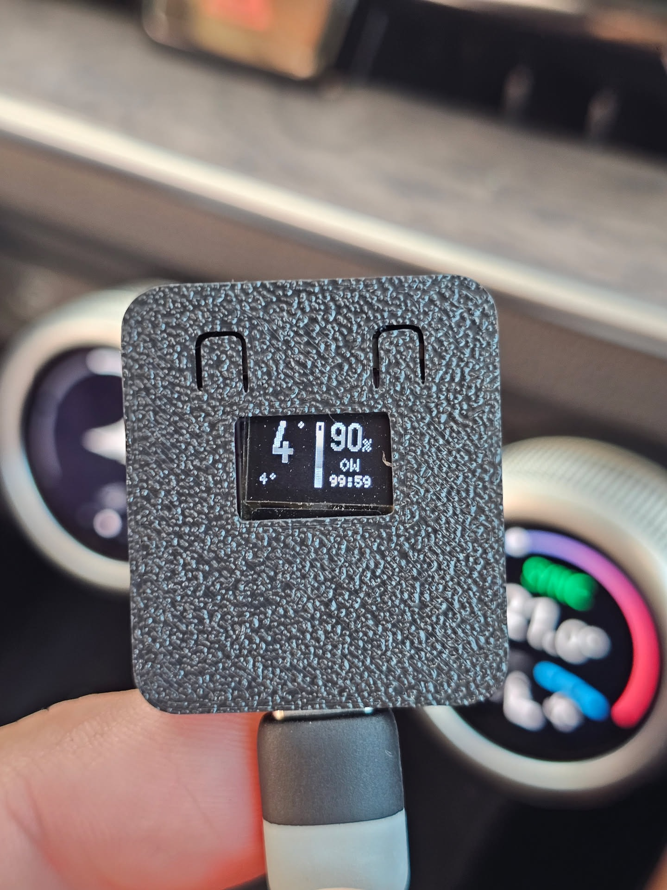
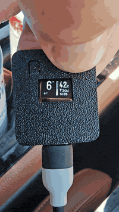
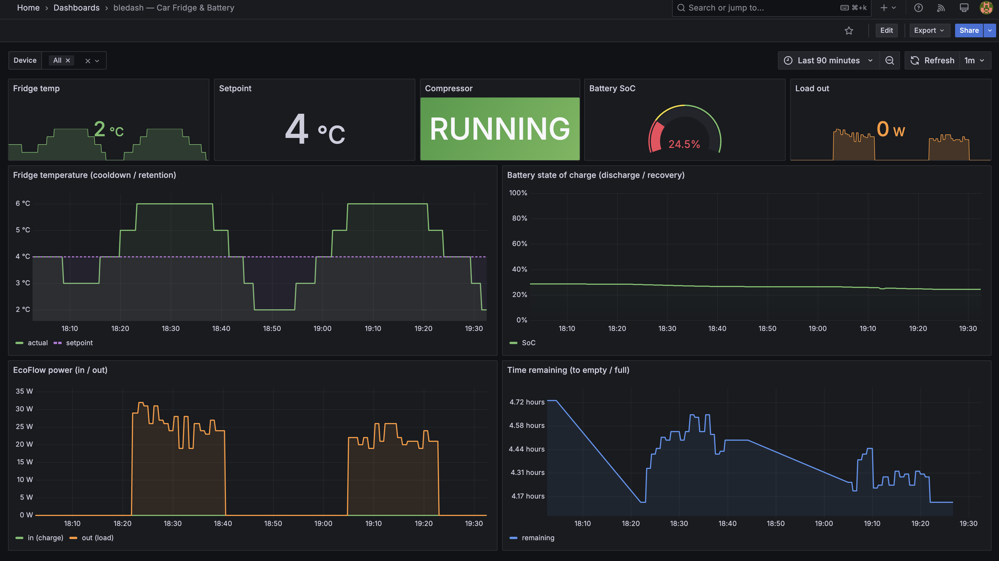

# bledash-esp32

Tiny ESP32 firmware that connects to your Bluetooth Low Energy (BLE) devices, polls them for status, and shows the readings on a small OLED — so you can glance at what your gear is doing without opening a vendor app on your phone.

Built for a very specific use case (see [MVP scope](#mvp-scope)) but designed so you can add support for more BLE devices, more screens, and more targets over time.

**Status:** [v0.3.0](https://github.com/lightheaded/bledash-esp32/releases/tag/v0.3.0) — adds **on‑device fridge power control**: press‑and‑hold the BOOT button to toggle the Alpicool on/off, with an on‑screen hold‑to‑confirm countdown (see below). On top of [v0.2.0](https://github.com/lightheaded/bledash-esp32/releases/tag/v0.2.0)'s **opt‑in EcoFlow watts, charge state & time‑to‑full** and the [v0.1.0](https://github.com/lightheaded/bledash-esp32/releases/tag/v0.1.0) MVP. Supported devices: **Alpicool** car fridges and **EcoFlow River 2 series** power stations. Supported hardware: **ESP32‑C3 "MINI" dev board with 0.42″ OLED**.



*One glance in the car: fridge at 6 °C (set 4°) on the left; EcoFlow at 90 %, discharging 21 W with ~15 h to empty on the right (advanced mode). The vertical bar doubles as a battery gauge.*

## Why

Vendor apps for BLE gear (fridges, power stations, chargers, scales, sensors) are all similarly annoying — you unlock your phone, open a proprietary app, wait for BLE pairing, look at a fancy but slow UI, close it. If all you want is *"what temp is the fridge, what's the SoC on the battery"*, an always-on tiny screen wins.

This firmware is a BLE Central that polls one or more BLE Peripherals on a schedule and renders their key metrics on a small OLED. No phone, no cloud, no vendor account.


*Reading the two real devices — EcoFlow River 2 Max (top) and Alpicool fridge (right) over BLE.*


*The board's readings track both devices' own displays.*

## MVP scope

- **Hardware:** ESP32‑C3 "MINI" board (2.4 GHz WiFi, BLE 5.0, 4 MB flash, ceramic antenna, USB Type‑C, onboard 0.42″ SSD1306 OLED, 72×40 px). ([AliExpress link](https://www.aliexpress.com/item/1005008570438676.html))
- **Power:** 5 V via USB‑C from the car's USB port (always‑on while the car is on).
- **Devices:**
  - Alpicool K‑series 12/24V compressor fridge — target temp, actual temp, on/off (via a held BLE connection).
  - EcoFlow River 2 Max portable power station — battery % (parsed passively from BLE advertisements; watts require an authenticated encrypted session, later shipped as an opt‑in — see below).
- **UI:** single page on the 72×40 display showing both devices (fridge temp + battery %); rotating pages only as fallback.
- **Cycle:** refresh each device once per minute.

**Non‑goals (for MVP):** battery‑powered operation, e‑ink display, web UI, cloud sync, MQTT bridge, OTA updates, multi‑fridge support. Some of these are on the roadmap; see [`plans/`](plans/).

## Hardware

The MVP targets one specific board because it was €3.34 on AliExpress and it works:

- **MINI ESP32‑C3 Development Board with 0.42" OLED**
  - ESP32‑C3 (RISC‑V single core, 160 MHz)
  - 4 MB flash, WiFi 4, Bluetooth 5.0 LE
  - Onboard 72×40 SSD1306 OLED (I²C, addr `0x3C`)
  - USB Type‑C, ceramic antenna
  - Widely cloned; sold under a dozen names


*Back of the board: the ESP32‑C3 module, ceramic antenna, and USB‑C.*

The firmware is written to be portable to other ESP32 targets (S3, S2, classic ESP32) as long as they have BLE and some sort of I²C/SPI display. PRs welcome.

## Quick start

The default build runs fridge temperature + EcoFlow battery % on one page (no account needed); opt in to `ECOFLOW_GATT` for EcoFlow watts + time‑to‑full (see the section below).

```bash
# 1. Install PlatformIO (or use the Arduino IDE with ESP32 board support 3.x+)
pipx install platformio

# 2. Clone and configure
git clone https://github.com/lightheaded/bledash-esp32
cd bledash-esp32
cp include/config.example.h include/config.h  # set the fridge MAC + EcoFlow serial

# 3. Flash
pio run -t upload
pio device monitor
```

## EcoFlow watts & time‑to‑full (advanced, opt‑in)


*The default view — EcoFlow **battery % only**, no account or connection needed. Opt in (below) for watts + charge state + time‑to‑full, as in the shot at the top of this README.*

By default bledash reads the EcoFlow **battery %** passively from its BLE advertisement — no account, no pairing, no connection. Opt in to the **authenticated GATT session** to also get **input/output watts, charge/discharge state, and time‑to‑full / time‑to‑empty**, read straight from the device (not estimated).

As far as we found, this is the first C/C++/ESP32 port of EcoFlow's authenticated BLE protocol (a legacy **secp160r1** ECDH handshake + a vendor key table + AES‑CBC, on top of the River 2 fixed‑offset heartbeat structs). Enable it in `include/config.h`:

```c
#define ECOFLOW_GATT     1
#define ECOFLOW_USER_ID  "1234567890123456789"   // your EcoFlow account userId
```

Fetch your `userId` once (it's a static per‑account value, reusable offline afterwards):

```bash
scripts/ecoflow_userid.py you@example.com 'password'   # add --host api-e.ecoflow.com for EU accounts
```

Caveats worth knowing:
- **Range.** The session needs a usable link (roughly ≥ −85 dBm). Farther than that, bledash stays on the passive battery‑% — the advertisement carries across a campsite, a full GATT session does not.
- **One BLE central.** While bledash holds the session the EcoFlow **phone app can't connect**, and vice‑versa.
- **Off by default, zero cost.** With `ECOFLOW_GATT 0` (the default) the session, crypto, and 64 KB key table are compiled out — the build is byte‑for‑byte the simple battery‑% firmware.

Full protocol write‑up, findings, and gotchas: [`plans/done/2026-07-15-01-ecoflow-gatt-telemetry.md`](plans/done/2026-07-15-01-ecoflow-gatt-telemetry.md).

## Fridge power control from the board



*Press‑and‑hold the **BOOT button** (~1 s) to toggle the fridge on/off. A full‑screen countdown confirms the hold — release early to cancel — then bledash sends the change over the connection it already holds and shows a spinner until the fridge confirms the new state. While off, the screen shows a compact **hold=ON** hint.*

Only the **BOOT button (GPIO9)** drives this. The board's other button is **RST** — the chip reset line, not a readable input — so it can't be repurposed. The toggle rebuilds the fridge's full settings struct from the last status read and flips **only** the power byte, so your setpoint, run mode, and battery‑protection settings are preserved rather than overwritten. Protocol details (the `SET` command layout) are in [`docs/protocols/alpicool.md`](docs/protocols/alpicool.md).

## Telemetry logging & upload (advanced, opt‑in)

The OLED answers *"what's it doing right now"*. For questions that need **history** — how fast the fridge pulls down from ambient, how much cold it holds unpowered, how long the battery lasts under a given load, what solar recovery looks like — bledash can log every reading to flash and, when WiFi is in range, ship the backlog to a time‑series database you point it at.

- **Local‑first.** One sample per minute is written to a LittleFS ring (~2 weeks) whether or not any network is present — the interesting curves happen while the car is parked and offline, so logging never depends on a link being up.
- **Opportunistic upload.** Whenever a configured WiFi network appears (a phone hotspot in the car, a home AP), the backlog drains over HTTPS with basic auth in **InfluxDB line protocol**, carrying each sample's original timestamp. The upload cursor advances only on a `2xx`, so a dropped connection re‑sends rather than loses.
- **Bring your own sink.** Anything that speaks InfluxDB line protocol works — InfluxDB, VictoriaMetrics / `vmagent` → Prometheus, Telegraf. Nothing about the backend is baked into the firmware; endpoint, credentials, and device tag all live in `config.h`.
- **Off by default, zero cost.** With `TELEMETRY_UPLOAD 0` (the default) the logger, the WiFi/TLS stack, and the embedded CA compile out entirely — the build is byte‑for‑byte the no‑WiFi firmware.

Enable it in `include/config.h` (a small WiFi glyph lights at the fridge column's lower‑right while the link is up):

```c
#define TELEMETRY_UPLOAD    1
#define TELEMETRY_DEVICE_TAG "car"     // tags each sample so multiple units stay distinct
#define WIFI_SSID           "..."
#define WIFI_PASS           "..."
#define TELEMETRY_URL       "https://your-host/write"   // line-protocol endpoint
#define TELEMETRY_USER      "..."
#define TELEMETRY_PASS      "..."
```

Multiple networks are supported — list them in `WIFI_AP_LIST` highest‑priority first (e.g. home WiFi before the car hotspot) and the device joins the best one in range. TLS is verified against an embedded ISRG Root X1 (Let's Encrypt) by default; set `TELEMETRY_CA_PEM` for a sink with a different issuer. Enabling this pulls in the WiFi/TLS stack, so the build uses a single‑app (`no_ota`) partition automatically. Design, storage format, and coexistence notes: [`plans/2026-07-24-01-telemetry-logging-upload.md`](plans/2026-07-24-01-telemetry-logging-upload.md).

An example Grafana dashboard for the `bledash_*` series ships in [`docs/grafana-dashboard-bledash.json`](docs/grafana-dashboard-bledash.json) — import it and pick your Prometheus datasource:



*Everything the analysis is for: the fridge duty‑cycling around its 4 °C setpoint (top‑left), the EcoFlow discharge curve (top‑right), load in/out, and live time‑to‑empty — all from the uploaded metrics, graphed off‑device.*

## Development — BLE connection contention

The Alpicool K25 accepts **one BLE connection at a time** and stops advertising while
connected. Anything else already talking to the fridge will block this firmware from
connecting (and vice versa). Before flashing/testing against the fridge, free the
connection slot:

**1. Release the fridge from Home Assistant.** If you run the `alpicool_ble` integration,
HA holds a persistent connection and retries forever. A helper toggles it for you over
Home Assistant's WebSocket API — no clicking through the HA UI:

```bash
scripts/ha-alpicool.py status    # show current state
scripts/ha-alpicool.py disable   # before a dev/test session
scripts/ha-alpicool.py enable    # ALWAYS re-enable when done
```

One-time setup: create `local/ha.env` (gitignored) with your HA host and a long-lived
token (HA profile → Security → Long-lived access tokens):

```
HA_HOST=<ha ip or hostname>
HA_TOKEN=<long-lived access token>
```

The script uses [`uv`](https://docs.astral.sh/uv/) (it self-installs its one dependency via
the inline script header). Config-entry disable is a WebSocket-only operation and the HA
OS SSH shell has no suitable client, so the helper runs from your dev machine rather than
over SSH.

**2. Force-quit the vendor phone apps.** A phone with the vendor app in the foreground
(or backgrounded but still holding BLE) grabs the same single slot:

- **Alpicool app** — force-kill it (swipe it away; don't just background it). This is the
  one that most often steals the fridge mid-session.
- **EcoFlow app** — with the default (passive advertisement scan) a running EcoFlow app
  doesn't conflict. But with `ECOFLOW_GATT` enabled bledash holds an authenticated
  connection to the River 2 Max, which is single-central like the fridge — so the app and
  bledash then contend for it. Force-kill the app if the session won't authenticate or the
  unit stops advertising (some firmware quiets the manufacturer-data advert while connected).

## Roadmap

Tracked as dated plan documents under [`plans/`](plans/). Each plan is a self‑contained proposal; once shipped, it moves to `plans/done/` with a link to the commits.

Done:
- ✅ MVP (v0.1.0): Alpicool + EcoFlow on the ESP32‑C3 MINI board — see [`plans/done/2026-07-08-01-mvp-esp32c3-oled.md`](plans/done/2026-07-08-01-mvp-esp32c3-oled.md). Remaining from that plan: M6 car install.
- ✅ Reverse‑engineer notes for both BLE protocols, published under [`docs/protocols/`](docs/protocols/).
- ✅ **EcoFlow watts, charge state & time‑to‑full** via the authenticated GATT session (opt‑in). See the section above and [`plans/done/2026-07-15-01-ecoflow-gatt-telemetry.md`](plans/done/2026-07-15-01-ecoflow-gatt-telemetry.md).
- ✅ **On‑device fridge power control** (v0.3.0): press‑and‑hold the BOOT button to toggle the Alpicool on/off, with a hold‑to‑confirm countdown and a pending spinner. See the section above.
- ✅ **Telemetry logging + opportunistic upload** (opt‑in): local flash ring + WiFi/HTTPS drain to any InfluxDB‑line‑protocol sink, for off‑device history and graphing. See the section above and [`plans/2026-07-24-01-telemetry-logging-upload.md`](plans/2026-07-24-01-telemetry-logging-upload.md).

Next up:
- **On‑device EcoFlow control** — toggle the EcoFlow's AC/DC outputs over the authenticated GATT session (the write path can reuse the session bledash already establishes). Note the board's only usable button is **BOOT/GPIO9** — the other is RST — so multi‑target control needs a soldered button or a press‑gesture scheme.

Later:
- Support for the LOLIN S3 Mini + 2.13″ e‑ink shield (battery‑powered v2 — separate plan when the hardware lands).
- Web config page over SoftAP for setting device MACs without a rebuild.
- Add more supported devices — smart plugs, ATC/pvvx thermometers, BLE scales.
- OTA firmware updates over the WiFi link the telemetry feature already brings up.

## Related work / prior art

This project stands entirely on other people's reverse‑engineering. The Alpicool driver was ported from the byte layout in a working Home Assistant integration; the EcoFlow advertisement parser draws on the community projects below.

- **Alpicool BLE** — [Gruni22/alpicool_ha_ble](https://github.com/Gruni22/alpicool_ha_ble), the Home Assistant integration whose `FE FE` framing and status byte layout this project's driver is built from. Details in [`docs/protocols/alpicool.md`](docs/protocols/alpicool.md).
- **EcoFlow BLE** —
  - [npike/ha-ecoflow-ble](https://github.com/npike/ha-ecoflow-ble) — passive advertisement parsing (manufacturer ID, serial, battery byte); the basis for this project's Tier 1 battery reading.
  - [rabits/ha-ef-ble](https://github.com/rabits/ha-ef-ble) and [rabits/ef-ble-reverse](https://github.com/rabits/ef-ble-reverse) — the authenticated GATT protocol (River 2 Max supported); the basis for this project's Tier 2 watts / remaining‑time implementation.
  - [avaver/ecoflow-ble](https://github.com/avaver/ecoflow-ble) and [nielsole/ecoflow-bt-reverse-engineering](https://github.com/nielsole/ecoflow-bt-reverse-engineering) — earlier Delta‑2‑era protocol notes.
- **EcoFlow local API** — [`ecoflow-mqtt`](https://github.com/tolwi/hassio-ecoflow-cloud) and `hassio-ecoflow` documented the LAN/cloud protocol (not used here, but useful cross‑reference).
- **ATC / pvvx firmware** for Xiaomi thermometers — inspiration for the "small device, big number, glanceable" UI philosophy.

## Contributing

This is a personal homelab hobby project first and an open‑source project second. If you've got a similar itch, PRs are welcome — but please:

1. Open an issue first for anything larger than a bug fix, so we can agree on the shape.
2. New device support goes in `src/devices/<vendor>_<model>.{cpp,h}` with a documented protocol note under `docs/protocols/`.
3. No proprietary SDKs — everything must be reverse‑engineered from observation, not decompiled from vendor apps.

## License

MIT — see [`LICENSE`](LICENSE).

## Acknowledgements

- [@Gruni22](https://github.com/Gruni22) for the Alpicool BLE reverse‑engineering (`alpicool_ha_ble`).
- [@npike](https://github.com/npike), [@rabits](https://github.com/rabits), [@avaver](https://github.com/avaver), and [@nielsole](https://github.com/nielsole) for the EcoFlow BLE reverse‑engineering the EcoFlow parser builds on.
- [olikraus](https://github.com/olikraus/u8g2) (u8g2) and [h2zero](https://github.com/h2zero/NimBLE-Arduino) (NimBLE‑Arduino) for the display and BLE libraries.
