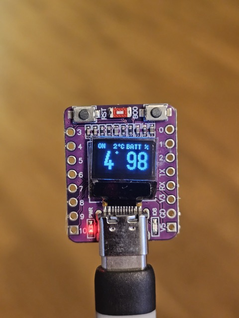
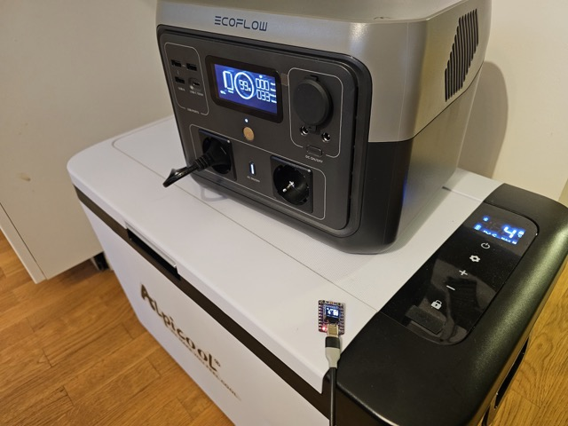
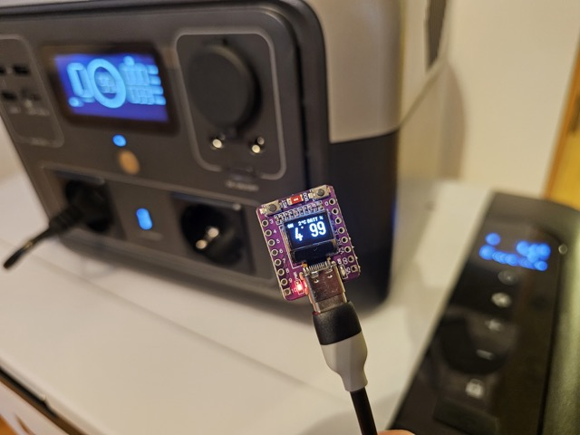
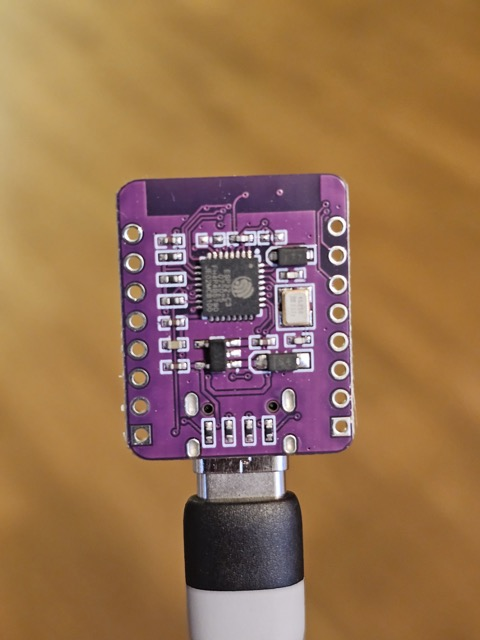

# bledash-esp32

Tiny ESP32 firmware that connects to your Bluetooth Low Energy (BLE) devices, polls them for status, and shows the readings on a small OLED — so you can glance at what your gear is doing without opening a vendor app on your phone.

Built for a very specific use case (see [MVP scope](#mvp-scope)) but designed so you can add support for more BLE devices, more screens, and more targets over time.

**Status:** MVP shipped ([v0.1.0](https://github.com/lightheaded/bledash-esp32/releases/tag/v0.1.0)). First supported devices: **Alpicool** car fridges and **EcoFlow River 2 series** power stations. First supported hardware: **ESP32‑C3 "MINI" dev board with 0.42″ OLED**.



*One glance: fridge is ON at 4 °C (set 2 °C), battery at 98 %.*

## Why

Vendor apps for BLE gear (fridges, power stations, chargers, scales, sensors) are all similarly annoying — you unlock your phone, open a proprietary app, wait for BLE pairing, look at a fancy but slow UI, close it. If all you want is *"what temp is the fridge, what's the SoC on the battery"*, an always-on tiny screen wins.

This firmware is a BLE Central that polls one or more BLE Peripherals on a schedule and renders their key metrics on a small OLED. No phone, no cloud, no vendor account.



*Reading the two real devices — EcoFlow River 2 Max (top) and Alpicool fridge (right) over BLE.*



*The board's readings track both devices' own displays.*

## MVP scope

- **Hardware:** ESP32‑C3 "MINI" board (2.4 GHz WiFi, BLE 5.0, 4 MB flash, ceramic antenna, USB Type‑C, onboard 0.42″ SSD1306 OLED, 72×40 px). ([AliExpress link]([url](https://www.aliexpress.com/item/1005008570438676.html)))
- **Power:** 5 V via USB‑C from the car's USB port (always‑on while the car is on).
- **Devices:**
  - Alpicool K‑series 12/24V compressor fridge — target temp, actual temp, on/off (via a held BLE connection).
  - EcoFlow River 2 Max portable power station — battery % (parsed passively from BLE advertisements; watts require an authenticated encrypted session and are deferred).
- **UI:** single page on the 72×40 display showing both devices (fridge temp + battery %); rotating pages only as fallback.
- **Cycle:** refresh each device once per minute.

**Non‑goals (for MVP):** battery‑powered operation, e‑ink display, web UI, cloud sync, MQTT bridge, OTA updates, multi‑fridge support. Some of these are on the roadmap; see [`plans/`](plans/).

## Hardware

The MVP targets one specific board because it was €3.34 on AliExpress and it works:

- **MINI ESP32‑C3 Development Board with 0.42" OLED**
  - ESP32‑C3 (RISC‑V single core, 160 MHz)
  - 4 MB flash, WiFi 4, Bluetooth 5.0 LE
  - Onboard 72×40 SSD1306 OLED (I²C, addr `0x3C`)
  - USB Type‑C, ceramic antenna
  - Widely cloned; sold under a dozen names



*Back of the board: the ESP32‑C3 module, ceramic antenna, and USB‑C.*

The firmware is written to be portable to other ESP32 targets (S3, S2, classic ESP32) as long as they have BLE and some sort of I²C/SPI display. PRs welcome.

## Quick start

MVP (v0.1.0) runs: fridge temperature + EcoFlow battery on one page.

```bash
# 1. Install PlatformIO (or use the Arduino IDE with ESP32 board support 3.x+)
pipx install platformio

# 2. Clone and configure
git clone https://github.com/lightheaded/bledash-esp32
cd bledash-esp32
cp include/config.example.h include/config.h  # set the fridge MAC + EcoFlow serial

# 3. Flash
pio run -t upload
pio device monitor
```

## Development — BLE connection contention

The Alpicool K25 accepts **one BLE connection at a time** and stops advertising while
connected. Anything else already talking to the fridge will block this firmware from
connecting (and vice versa). Before flashing/testing against the fridge, free the
connection slot:

**1. Release the fridge from Home Assistant.** If you run the `alpicool_ble` integration,
HA holds a persistent connection and retries forever. A helper toggles it for you over
Home Assistant's WebSocket API — no clicking through the HA UI:

```bash
scripts/ha-alpicool.py status    # show current state
scripts/ha-alpicool.py disable   # before a dev/test session
scripts/ha-alpicool.py enable    # ALWAYS re-enable when done
```

One-time setup: create `local/ha.env` (gitignored) with your HA host and a long-lived
token (HA profile → Security → Long-lived access tokens):

```
HA_HOST=<ha ip or hostname>
HA_TOKEN=<long-lived access token>
```

The script uses [`uv`](https://docs.astral.sh/uv/) (it self-installs its one dependency via
the inline script header). Config-entry disable is a WebSocket-only operation and the HA
OS SSH shell has no suitable client, so the helper runs from your dev machine rather than
over SSH.

**2. Force-quit the vendor phone apps.** A phone with the vendor app in the foreground
(or backgrounded but still holding BLE) grabs the same single slot:

- **Alpicool app** — force-kill it (swipe it away; don't just background it). This is the
  one that most often steals the fridge mid-session.
- **EcoFlow app** — the MVP only *passively scans* EcoFlow advertisements (it never
  connects), so a running EcoFlow app usually doesn't conflict. Only force-kill it if the
  River 2 Max stops appearing in scans or its advertised battery byte goes stale — some
  firmware quiets the manufacturer-data advert while a central is connected.

## Roadmap

Tracked as dated plan documents under [`plans/`](plans/). Each plan is a self‑contained proposal; once shipped, it moves to `plans/done/` with a link to the commits.

Done:
- ✅ MVP (v0.1.0): Alpicool + EcoFlow on the ESP32‑C3 MINI board — see [`plans/done/2026-07-08-01-mvp-esp32c3-oled.md`](plans/done/2026-07-08-01-mvp-esp32c3-oled.md). Remaining from that plan: M6 car install.
- ✅ Reverse‑engineer notes for both BLE protocols, published under [`docs/protocols/`](docs/protocols/).

Next up:
- **More EcoFlow stats** — input W, output W, and remaining time. These aren't in the advertisement; they need the authenticated encrypted GATT session (ECDH + protobuf), which no ESP32 implementation exists for yet. See the Tier 2 notes in [`docs/protocols/ecoflow.md`](docs/protocols/ecoflow.md).
- **On‑device control over BLE** — use the board's two buttons (BOOT + a free GPIO) to turn the fridge and the EcoFlow on/off. The Alpicool write path is already known (see `docs/protocols/alpicool.md`); the EcoFlow side depends on the Tier 2 session above.

Later:
- Support for the LOLIN S3 Mini + 2.13″ e‑ink shield (battery‑powered v2 — separate plan when the hardware lands).
- MQTT bridge (optional WiFi mode for home use).
- Web config page over SoftAP for setting device MACs without a rebuild.
- Add more supported devices — smart plugs, ATC/pvvx thermometers, BLE scales.

## Related work / prior art

This project stands entirely on other people's reverse‑engineering. The Alpicool driver was ported from the byte layout in a working Home Assistant integration; the EcoFlow advertisement parser draws on the community projects below.

- **Alpicool BLE** — [Gruni22/alpicool_ha_ble](https://github.com/Gruni22/alpicool_ha_ble), the Home Assistant integration whose `FE FE` framing and status byte layout this project's driver is built from. Details in [`docs/protocols/alpicool.md`](docs/protocols/alpicool.md).
- **EcoFlow BLE** —
  - [npike/ha-ecoflow-ble](https://github.com/npike/ha-ecoflow-ble) — passive advertisement parsing (manufacturer ID, serial, battery byte); the basis for this project's Tier 1 battery reading.
  - [rabits/ha-ef-ble](https://github.com/rabits/ha-ef-ble) and [rabits/ef-ble-reverse](https://github.com/rabits/ef-ble-reverse) — the authenticated GATT protocol (River 2 Max supported), for the deferred Tier 2 watts/remaining‑time work.
  - [avaver/ecoflow-ble](https://github.com/avaver/ecoflow-ble) and [nielsole/ecoflow-bt-reverse-engineering](https://github.com/nielsole/ecoflow-bt-reverse-engineering) — earlier Delta‑2‑era protocol notes.
- **EcoFlow local API** — [`ecoflow-mqtt`](https://github.com/tolwi/hassio-ecoflow-cloud) and `hassio-ecoflow` documented the LAN/cloud protocol (not used here, but useful cross‑reference).
- **ATC / pvvx firmware** for Xiaomi thermometers — inspiration for the "small device, big number, glanceable" UI philosophy.

## Contributing

This is a personal homelab hobby project first and an open‑source project second. If you've got a similar itch, PRs are welcome — but please:

1. Open an issue first for anything larger than a bug fix, so we can agree on the shape.
2. New device support goes in `src/devices/<vendor>_<model>.{cpp,h}` with a documented protocol note under `docs/protocols/`.
3. No proprietary SDKs — everything must be reverse‑engineered from observation, not decompiled from vendor apps.

## License

MIT — see [`LICENSE`](LICENSE).

## Acknowledgements

- [@Gruni22](https://github.com/Gruni22) for the Alpicool BLE reverse‑engineering (`alpicool_ha_ble`).
- [@npike](https://github.com/npike), [@rabits](https://github.com/rabits), [@avaver](https://github.com/avaver), and [@nielsole](https://github.com/nielsole) for the EcoFlow BLE reverse‑engineering the EcoFlow parser builds on.
- [olikraus](https://github.com/olikraus/u8g2) (u8g2) and [h2zero](https://github.com/h2zero/NimBLE-Arduino) (NimBLE‑Arduino) for the display and BLE libraries.
