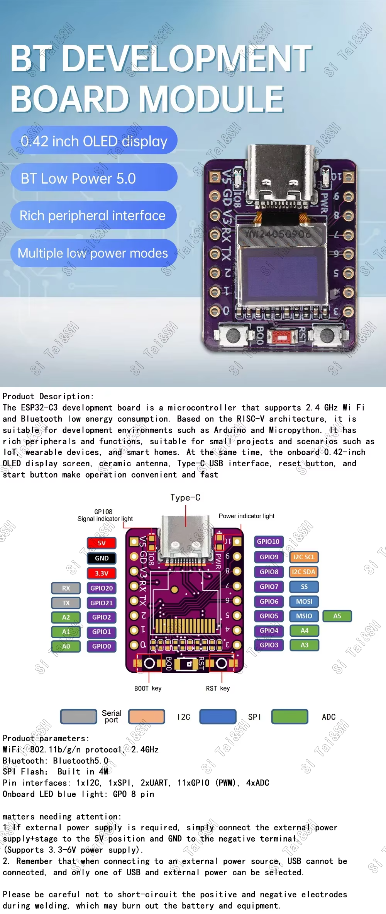

# MVP: ESP32‑C3 MINI + 0.42″ OLED reading Alpicool K25 + EcoFlow River 2 Max via BLE

- **Date:** 2026‑07‑08
- **Status:** proposed
- **Target hardware:** MINI ESP32‑C3 dev board (RISC‑V, BLE 5.0, onboard 72×40 SSD1306 OLED, USB‑C), €3.34, already in inventory.
- **Target devices:**
  - Alpicool K25 (car fridge). BLE MAC known from the HA config entry.
  - EcoFlow **River 2 Max** (portable power station). BLE MAC unknown yet — M2 scan will find it by matching the device serial embedded in its BLE advertisement.
  - Device identifiers (MACs, serials) live in the gitignored `local/devices.md` and, once code exists, `include/config.h` — **never in committed files**.
- **Two EcoFlows in the house — do not confuse them.** The target is the **River 2 Max** (portable, serial prefix `R611`), used in the car and on the go. There is also a stationary **River 2** (serial prefix `R601`) in the techroom. Both are on WiFi and visible in HA, and both advertise over BLE, so any BLE scan run at home sees **both**. The firmware must match on the River 2 Max's specific serial (from `config.h`), never on device‑type or "any EcoFlow", or it can latch onto the techroom unit. Exact serials are in `local/devices.md`.
- **Power source:** car USB port (5 V, always‑on while the car is on) — **no battery, no deep sleep, no e‑ink**. The battery‑powered "off‑grid" variant is deferred to a v2 plan.

## Goals

A tiny always‑on display that lives in the car showing, on a **single page**:

- **Alpicool:** actual temp (big), target temp (small), on/off state.
- **EcoFlow:** battery % (big).

Poll/refresh each device roughly once per minute. Single page is the design target; only if it genuinely doesn't fit do we fall back to rotating pages (short dwell, minimal page count — quick glances while driving must stay feasible). Try the one‑page layout first.

**Why battery % only for EcoFlow (MVP):** research (see protocol notes below) shows the River 2 series *broadcasts battery % in its BLE advertisement* — readable passively with no connection, no pairing, no crypto. Input/output watts exist over BLE too, but only behind an authenticated, encrypted GATT session (ECDH + proprietary key table + protobuf) that no ESP32 implementation exists for yet. Watts are therefore a stretch goal, not MVP. Conveniently, the single‑page layout only wanted battery % anyway.

## Non‑goals for this plan

- Battery‑powered operation (deferred to v2 — see the LOLIN S3 Mini + e‑ink shield plan when it's written).
- WiFi / MQTT / cloud (BLE only for MVP).
- **EcoFlow authenticated GATT session (input/output watts, remaining time)** — deferred; see protocol notes for the (large) scope of that work.
- OTA updates (flash via USB is fine for now).
- Web UI / config over SoftAP (device MACs compiled in via `config.h`).
- Multi‑fridge or multi‑battery support (one of each).
- Button functionality: later might want to turn devices on/off or tweak the target temperature.

## Hardware

### The board

- **MINI ESP32‑C3 Development Board with 0.42" OLED** ([€3.34 on AliExpress]([url](https://www.aliexpress.com/item/1005008570438676.html))).
- ESP32‑C3 (RISC‑V single core, 160 MHz), 4 MB flash, WiFi 4, **BLE 5.0**.
- **Onboard 72×40 SSD1306 OLED**, I²C at address `0x3C` on **`SDA=GPIO5`, `SCL=GPIO6`** — confirmed at M1 by probing: the controller ACKs on GPIO5/6, and GPIO8/9 (the vendor pinout's I²C label) gives no response, so that label is the header breakout, not the onboard OLED.
- USB Type‑C. Ceramic antenna. No PSRAM, no SD, no battery‑management.



### The car cable

Short USB‑C → USB‑C from the car's dashboard USB port. Nothing fancy. Length TBD once we know where the board sits.

### Physical mount

Out of scope for the firmware plan. A 3D‑printed cradle is likely; that's for a follow‑up.

## Constraints imposed by the hardware

1. **Single core.** ESP32‑C3 is one RISC‑V core. NimBLE handles a held connection + passive scanning concurrently fine; our own logic stays a simple serialized loop: handle notifications → parse adverts → render. Trivial at a 60‑second cadence.
2. **Tiny display.** 72×40 pixels is roughly 2 lines of readable text and one large number, *or* two big numbers side by side. UI must be extremely reductive.
3. **BLE range.** ESP32‑C3 with ceramic antenna, mounted in a metal car, reading a fridge in the boot and a power station on the floor behind the driver — range will be marginal. Plan a test drive early to confirm actual RSSI at those distances **before** investing in UI polish.
4. **No hardware RTC.** Not needed — always‑on USB power means we don't sleep; the ESP32‑C3's internal timekeeping is sufficient for scheduling.

## BLE contention & coexistence with Home Assistant

Both target devices are already integrated into HA (checked on 2026‑07‑08 via ssh into the HA box), and that changes the connection strategy:

### Alpicool K25 — real contention, must be designed for

- HA runs the `alpicool_ble` custom integration (Gruni22, v3.1.5) through the house's **ESPHome Bluetooth proxies** (living room, bedroom, nursery, office).
- Inspected its source on the HA box: it holds a **persistent BLE connection** — connects at setup, polls a QUERY over the held connection every **30 s**, and if disconnected retries reconnect every **60 s, forever**. It never idles.
- BLE peripherals like the K25 accept **one central at a time** and stop advertising while connected. So whenever the fridge is within proxy range (parked at home / unloading / dev bench), HA and the ESP32 **race for the single connection slot; whoever connects first keeps it**.
- Consequences and strategy:
  - **ESP32 also holds a persistent connection** (we have wall power; this mirrors the proven HA approach). A connect‑poll‑disconnect cycle would be worse: every disconnect gap hands the fridge to HA's 60 s reconnect loop, and then the ESP32 fails its next poll — ping‑pong forever.
  - **In the car away from home:** no proxies in range → ESP32 always wins. This is the primary use case and it just works.
  - **At home:** it's a race. If the ESP32 is powered and wins, HA's fridge entities go unavailable (integration marks it after 5 min); if HA wins, the ESP32 shows the fridge as stale. Both are acceptable — pick per situation by powering the ESP32 off/on, or disable the HA integration if the dash wins long‑term.
  - **During development (important):** the dev bench is inside proxy range, so HA likely holds the K25 *right now*. Before M3 testing, **disable the Alpicool BLE config entry in HA** (Settings → Devices → Alpicool → Disable), and re‑enable when done. Otherwise connect attempts will fail confusingly.
  - **Fail fast:** before a (re)connect attempt, check the passive scan results — if the K25's MAC isn't advertising, someone else holds it; skip the attempt, mark stale, show it on the display (distinct "held elsewhere" vs "out of range" is a nice‑to‑have).

### EcoFlow River 2 Max — no contention by design

- HA reads it via `ecoflow_cloud` (WiFi → EcoFlow cloud MQTT) — **no BLE involvement from HA at all**.
- The MVP reads it via **passive advertisement scanning — we never connect**, so we can't collide with the EcoFlow phone app or anything else. (EcoFlow devices also allow only one BLE central; by not being a central to it, we sidestep that entirely.)
- Bonus: HA's cloud data doubles as a **validation oracle** — compare the battery % parsed from the advert against `sensor.*_battery_level` in HA during M4.

### ESP32 side

- WiFi stays off in MVP → no WiFi/BLE radio coexistence issue on the C3.
- NimBLE central: one held connection (Alpicool) + continuous/duty‑cycled passive scan (EcoFlow adverts) is well within its default limits.

## Software architecture

### High level

```
┌──────────────────────────────────────────────────────────────┐
│  main.cpp                                                     │
│  ┌───────────┐   ┌──────────────────────┐                     │
│  │ Scheduler │──▶│ BLE Central (NimBLE) │                     │
│  └───────────┘   │  · held conn: K25    │──▶ Device drivers ──▶ State
│        │         │  · passive scan: EF  │                     │
│        │         └──────────────────────┘                     │
│        └────────▶ ┌───────────┐                                │
│                   │ UI renderer│──▶ SSD1306                    │
│                   └───────────┘                                │
└──────────────────────────────────────────────────────────────┘
```

### Modules (proposed source layout)

```
bledash-esp32/
├── platformio.ini
├── include/
│   └── config.h              # device MACs/serials, poll interval (gitignored)
├── src/
│   ├── main.cpp              # setup + loop, scheduler
│   ├── ble_central.{cpp,h}   # NimBLE wrapper: held connection mgmt + passive scanner
│   ├── devices/
│   │   ├── alpicool.{cpp,h}  # Alpicool GATT protocol + payload parser
│   │   └── ecoflow.{cpp,h}   # EcoFlow advertisement parser (mfr data → SoC%)
│   ├── state.{cpp,h}         # in-memory struct of latest readings + timestamps
│   └── ui/
│       ├── display.{cpp,h}   # SSD1306 init + framebuffer helpers + px-shift
│       └── pages.{cpp,h}     # single-page layout (rotation only if needed)
└── docs/protocols/
    ├── alpicool.md
    └── ecoflow.md
```

### BLE library choice

**NimBLE-Arduino**, not the built‑in ESP32 BLE library. NimBLE uses ~50% less RAM/flash, is actively maintained, and is standard for ESP32‑C3 projects because the classic ESP32 BLE stack is heavier than what a C3 comfortably runs. This is the well‑trodden path.

### Runtime behavior

- **Alpicool:** hold the connection, subscribe to the notify characteristic, send a QUERY packet every **60 s** over the held connection. On disconnect: mark stale after 2 missed polls, attempt reconnect every 60 s, guarded by "is it advertising?" (see contention section).
- **EcoFlow:** passive BLE scan (duty‑cycled, e.g. a few seconds per minute — tune in M4; adverts are frequent so this is generous). Parse manufacturer data for the matching serial → battery %. Mark stale if no advert seen for 2 cycles.
- **Display:** re‑render on any state change and at least once a minute.
- Never block rendering on a failing device.

### Display / UI

- 72×40 monochrome. Use **u8g2** — its compact numeric bitmap fonts are what makes two large values readable at this size.
- **Single page (the target):** two columns — fridge temp left (e.g. `-18°`, big; `→-20` tiny below), battery % right (e.g. `84%`, big). One tiny status pip for fridge on/off.
- If a device is stale (>2 poll cycles missed): show `——` in its slot. Distinguish "connection held elsewhere" if cheap to detect.
- Fallback only if the single page proves unreadable: two rotating pages, short dwell, minimal count.
- **OLED burn‑in:** real but slow on SSD1306; content here is semi‑static for hours of driving. Mitigation is cheap: shift the whole frame by ±1–2 px on a slow cycle (every few minutes) — u8g2 makes this a render‑offset one‑liner. Also consider dimming via contrast. Good enough for MVP; revisit if a unit shows wear.

## BLE protocol notes

### Alpicool K25 — protocol KNOWN, verified against this exact fridge

No sniffing needed. The HA custom integration running against this K25 (`Gruni22/alpicool_ha_ble` v3.1.5, source inspected on the HA box) documents everything:

- **Advertised service:** `0x1234` or `0xFFF0` (integration matches both).
- **Write characteristic:** `00001235-0000-1000-8000-00805f9b34fb`; **notify characteristic:** `00001236-0000-1000-8000-00805f9b34fb`.
- **Framing:** `FE FE <len> <cmd> <payload…> <checksum:2B big-endian>`, checksum = 16‑bit sum of all preceding bytes. Notifications may fragment across packets — reassemble on the `FE FE` header + length byte.
- **Commands:** BIND = literal `fe fe 03 00 01 ff` (send once after connect), QUERY = literal `fe fe 03 01 02 00`.
- **QUERY response payload (single‑zone):** `[0]` locked, `[1]` powered_on, `[2]` run_mode (Eco/Max), `[3]` battery‑protection level, `[4]` target temp (signed), `[5]/[6]` temp max/min, `[9]` unit, `[14]` **actual temp** (signed), `[15]` input battery %, `[16]/[17]` input voltage int/dec.
- MVP needs exactly: `[1]`, `[4]`, `[14]` (+ maybe `[3]`).
- Port the logic (it's ~100 lines of framing/parsing), **check the repo's license before copying code verbatim** — if it's GPL and thus incompatible with our MIT, re‑implement from the byte‑layout facts above (protocol facts aren't copyrightable) and credit the repo in `docs/protocols/alpicool.md`.

### EcoFlow River 2 Max — two tiers

**Tier 1 (MVP): passive advertisement → battery %.** The River 2 series broadcasts manufacturer data (manufacturer ID `46517` / `0xB5B5`) containing the 16‑byte ASCII device serial at offset 3 and the battery‑percent byte at **offset 19** — confirmed at M2 against HA's cloud sensor for both house units. No connection, no auth. Match on the device serial (from `config.h`), not device‑type, since both house EcoFlows advertise `0xB5B5`. Full layout in `docs/protocols/ecoflow.md`.

**Tier 2 (deferred): authenticated GATT session → watts, remaining time.** Fully reverse‑engineered in Python by `rabits/ha-ef-ble` (River 2 Max explicitly supported) + `rabits/ef-ble-reverse`, but it requires: an EcoFlow account userId (obtained once out‑of‑band), an ECDH handshake on the legacy **SECP160r1** curve (not in stock mbedtls builds), a proprietary key table extracted from the vendor app, MD5 session‑key derivation, and protobuf decoding (nanopb). **No C/C++/ESP32 implementation exists anywhere — this would be a first port.** Genuinely interesting v2 project; firmly out of MVP. Document findings in `docs/protocols/ecoflow.md`.

Note: EcoFlow firmware updates can silently change either tier — treat parsed values with suspicion after device updates.

## Milestones

Roughly one evening each. Each milestone is a separately merge‑able PR.

- **M1 — Hello display.** Flash the board, initialize the 72×40 OLED with u8g2, show "bledash" and a pixel‑animated dot. Confirm which GPIOs the OLED I²C is on for this specific clone. Merge.
- **M2 — BLE scan / recon.** NimBLE passive scan, dump advertisers (name, MAC, RSSI, service UUIDs, manufacturer data hex) to serial. Confirm: K25 advertising (disable the HA integration first — `scripts/ha-alpicool.py disable`), the **River 2 Max's** BLE MAC + manufacturer‑data layout, and the battery‑% byte offset for the R611 (cross‑check against HA's cloud sensor). Expect to see the techroom **River 2** (`R601`) in the scan too — confirm the serials differ so the R611 match is unambiguous. Record findings in `docs/protocols/`. Merge.
- **M3 — Alpicool driver.** Held connection + BIND + QUERY/notify parse (port from the HA integration's byte layout). Render temp + setpoint + on/off. Test the HA‑contention behavior explicitly: re‑enable HA integration, verify ESP32 fails gracefully (stale display, no crash‑loop). Merge.
- **M4 — EcoFlow advert parser.** Passive scan → serial match → battery %. Validate against HA cloud sensor over a charge/discharge. Render on the shared page. Merge.
- **M5 — Scheduler + single‑page UI polish.** 60 s cadence, stale detection, px‑shift burn‑in guard. Decide single page vs fallback rotation with real data on the real display. Ship a v0.1.0 tag. Merge.
- **M6 — Car install.** Mount, run a week, note range issues / disconnect frequency. Follow‑up PRs from that.

## Risks

| Risk | Likelihood | Mitigation |
|---|---|---|
| EcoFlow battery‑% advert offset differs on River 2 Max vs River 2 | Medium | M2 verifies empirically against HA cloud sensor before any driver code. |
| Alpicool connection contention with HA at home / dev bench | High (at home), None (in car) | Held connection + advertising‑check before reconnect; disable HA entry during dev; documented behavior above. |
| BLE range in‑car is marginal | Medium | Test drive at M5 before physical install. Consider external antenna variant if needed. |
| Alpicool BLE protocol varies between firmware revisions of the K25 | Low | Protocol source is verified against *this* K25 via HA. Version the parser; log unknown payloads anyway. |
| 72×40 is too small for two values at a glance | Low | Prototype the UI at M1 with realistic values; fall back to rotating pages. |
| OLED burn‑in | Low‑medium | Px‑shift every few minutes + contrast dimming (see UI section). |
| Gruni22 repo license incompatible with MIT | Low | Re‑implement from byte‑layout facts; credit in protocol docs. |

## v2 hooks (not in this plan)

- **EcoFlow authenticated BLE session** (watts, remaining time) — first‑ever ESP32 port of the `rabits/ef-ble-reverse` protocol; big, fun, separate plan.
- Battery‑powered off‑grid variant with the LOLIN S3 Mini + 2.13″ e‑ink shield + 18650 (charging via TP4056, boost via MT3608 — both ordered 2026‑07‑08, ×10 each). Separate plan when the hardware lands.
- WiFi/MQTT publish for home dashboards.
- OTA updates via SoftAP.
- More device drivers (BLE smart plugs, ATC/pvvx thermometers, BLE scales).

## Open questions

1. ~~Which GPIO pair is the onboard OLED on?~~ **Resolved at M1: `SDA=GPIO5`, `SCL=GPIO6`** (SSD1306 ACKs at `0x3C`; GPIO8/9 does not respond). The vendor pinout's GPIO8/9 I²C label is the header breakout.
2. ~~Does the River 2 Max keep advertising while its WiFi/cloud link is active?~~ **Resolved at M2: yes.** Both EcoFlows (on WiFi/cloud) were seen advertising with live battery data.
3. ~~Exact battery‑% offset in the R611 manufacturer data?~~ **Resolved at M2: offset 19**, verified against HA.
4. Does holding the Alpicool connection from the ESP32 for hours cause the fridge to misbehave (app lockout, watchdog resets)? M3/M6 observe.
5. Alpicool advert confirmed at M2: service `0xFFF0`, name `A1-<MAC>`, no telemetry in the advert (all `0xFF`) — readings require a GATT connect + QUERY, as planned for M3.
